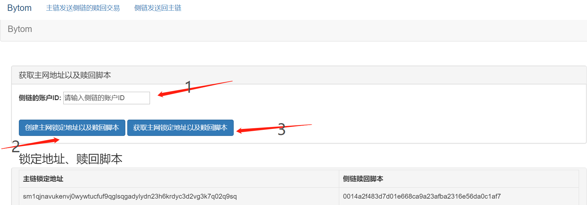
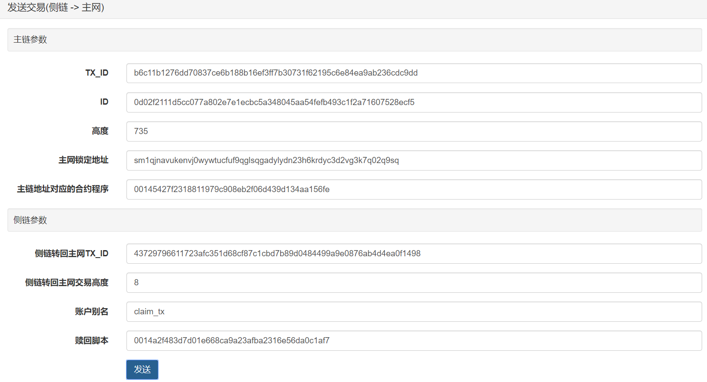

# Vapor 侧链部署说明

## 启动 vapor

```
./bytomd-sidechain init --chain_id solonet -r "side_chain"
./bytomd-sidechain node -r "side_chain"
```

## 获取公私钥

```
curl -s -X POST -d '{}' http://127.0.0.1:8888/create-key-pair  > key_pair
```

## 停止vapor并删除数据目录

```
rm -rf side_chain
```


## 启动 bytomd、vapor

- bytomd
```
./bytomd init --chain_id solonet -r "main_chain"
./bytomd node -r "main_chain"
```

- vapor
  fedpeg_xpubs、sign_block_xpubs、signer为上面获取的公私钥
```
xprv=$(cat key_pair | jq ".data.xprv" | sed "s/\"//g")
xpub=$(cat key_pair | jq ".data.xpub" | sed "s/\"//g")

./vapor init --chain_id solonet -r "side_chain"

./vapor node -r "side_chain" --auth.disable --side.fedpeg_xpubs $xpub  --side.sign_block_xpubs $xpub --signer $xprv --validate_pegin true --side.parent_genesis_block_hash "a97a7a59e0e313f9300a2d7296336303889930bfdf5a80d8a9b05db343c03380"
```

## 启动侧链工具

拷贝key_pair到目录tools/side_chain_tool/

* [参考侧链工具README](tools/side_chain_tool/README.md)

## Bytom----->Vapor
- 工具页面输入侧链账户ID，获取mainchain_address(主链锁定地址)、claim_script(赎回脚本)

  

- 在主链的dashboard，发送btm到mainchain_address

- 工具页面赎回交易填入参数，发送交易

  

## Vapor----->Bytom
- 在主链的dashboard，新建一个主链地址，并备份

- 在侧链的dashboard，导入主链的备份，找到与主链新建地址相同的ctrlProgram的地址，并发送交易到这个地址

- 在侧链的dashboard上retire上面地址的资产

- 工具网页的侧链发送回主链的页面填入参数，发送交易

  